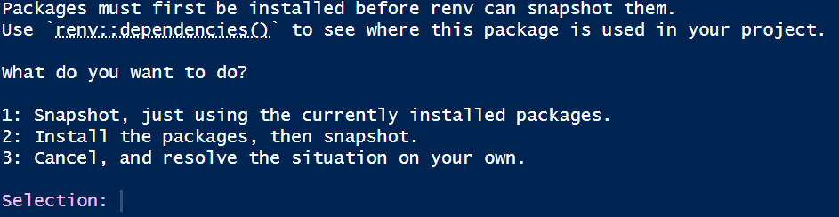
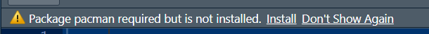
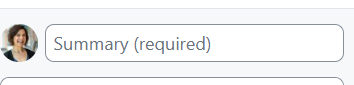
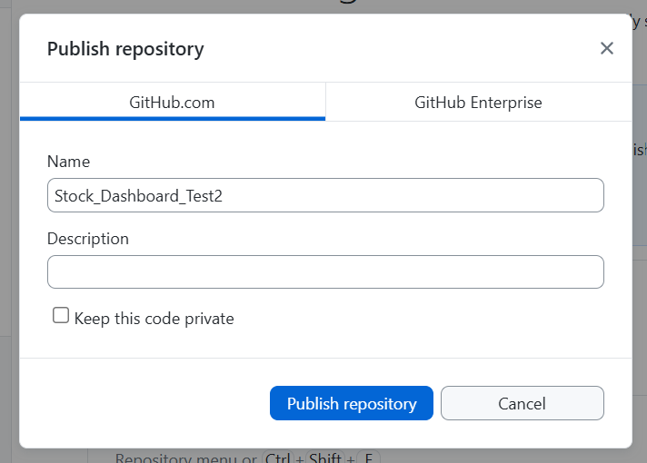
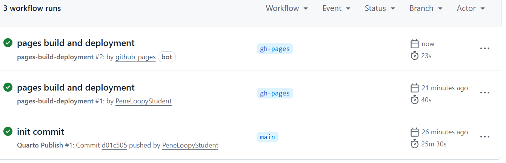
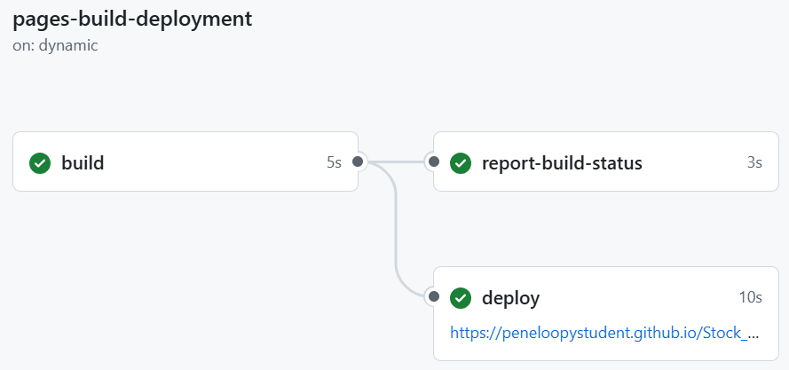
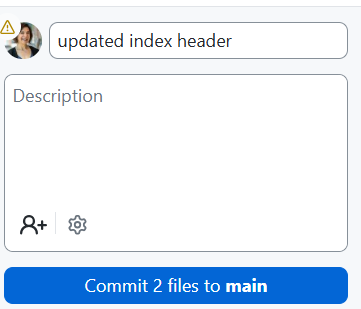

```{r include=F}
#| label: setup

options(scipen=100)                         # suppress scientific notation

# avoid system issues
options(install.packages.check.source = "no")

                                            # install pacman if needed
if (!require("pacman")) install.packages("pacman", repos = "http://lib.stat.cmu.edu/R/CRAN/")
pacman::p_load(pacman, tidyverse, ggthemes, gridExtra, magrittr,
               kableExtra, gt, quarto)

#pacman::p_loaded()

```

# Complete these Tasks First

::: callout-tip
### What students need before starting

This section ensures everyone has the correct software and
accounts before beginning to publish a dashboard.
:::

## Download and Install Software

-  [ ] Download and install **R** from **<https://cran.r-project.org>**.\
-  [ ] Download and install **RStudio** from **<https://posit.co/download/rstudio-desktop/>**.\
-  [ ] Download and install the **Quarto CLI** from **<https://quarto.org/docs/get-started/>**.\
-  [ ] Download and install GitHub Desktop from **<https://desktop.github.com/download/>**.\

## Create a GitHub Account

::: callout-tip

### I recommend Gmail

I have done this multiple times using different gmail accounts to create multiple GitHub accounts and the process has been straightforward.

:::

-   [ ] Go to **<https://github.com>** and click **Sign Up**.\
-   [ ] Choose a username, email, and password.\
-   [ ] Verify your email and complete setup.\

## Generate a Personal Access Token (PAT)

::: callout-warning
### Important
- **According to AI:** GitHub no longer accepts passwords for Git operations; a Personal Access Token (PAT) is required instead.

- Despite the statement above, I have been able to sign-in with a password.

- I recommend saving the PAT as a precaution and keeping it handy.  

- I did not need my PAT when I added a new GitHub account to my GitHub Desktop but you might. 
:::

-   [ ] Log into GitHub and go to **Settings → Developer settings → Personal access tokens → Tokens (classic)**\
-   [ ] Click **Generate new token (classic)**\
-   [ ] Name it (e.g., “GitHub Desktop Token”), set
    expiration, and check **repo** scope.\
-   [ ] Click **Generate** and copy and save the token immediately.

## Add GitHub account/PAT to GitHub Desktop

-   [ ] Open GitHub Desktop → **File → Options → Accounts**.\
-   [ ] Click **Sign in to GitHub.com**.\
-   [ ] When prompted for your password, paste your PAT instead.


# Create and Render a Quarto Website

::: callout-tip
### Dashboard Website will be Incomplete until Lecture 27 
- This checklist will help you create and publish your stock dashboard.  
- Before Lecture 27 you will simply create the framework. 
- In Lecture 27, I will provide the code and text to everyone in class to complete dashboard.
:::

## Create a New Quarto Website Project in RStudio

-   [ ] In RStudio: **File → New Project → New Directory → Quarto Website**.\
-   [ ] Enter a directory name (e.g., `Stock_Dashboard`).\
-   [ ] Choose a location on your computer (e.g., Desktop).\
-   [ ] Ensure these boxes are checked:
    -   [ ] Create a git repository\
    -   [ ] Use renv with this project\
    -   [ ] Use visual markdown editor (not required)
-   [ ] Click **Create Project**.

## Modify Project as Follows:

- [ ] In the folder for this project, delete **`about.qmd`**.\
- [ ] Download this zipped folder, **[dashboard_files.zip](https://drive.google.com/file/d/1Xj8OpR_tx5H2-j9hX1aZewgC5vixZz78/view?usp=sharing){target="_blank"}**, and unzip it.\
- [ ] Place all the files in the project folder you created above.\
  - **Replace files in your destination folder**.\

## Update `renv`

- [ ] In the **`Console`**, type **`renv::snapshot()`**.\
- [ ] Click **Enter** or **Return**, and then select **Option 2**.\
    - This process will take time.\
{fig-align="center"}
- [ ] When you see the question **`Do you want to proceed?`**, type **`Y`**.
- [ ] In the **`Console`**, type **`renv::status()`**, and confirm that you receive this message: **`No issues found -- the project is in a consistent state.`**.

::: callout-tip
### The `renv` update needs to be repeated periodically.
- **`renv`** is a software 'bubble' within your software.  
- As you expand your project or the packages are updated, the above **Update `renv`** steps will need to be repeated.
- If you see the message **`The project is out-of-sync -- use renv::status() for details.`**, repeat the **Update `renv`** process.
:::


## Render Incomplete Dashboard

- [ ] If you see a message like the one in this screenshot, at the top for any packages, click install.\
{fig-align="center"}
- [ ] Run **`Setup`** chunk.\
- [ ] Render (incomplete) dashboard.\
- [ ] Verify that that the rendering has created an **`.html`** file.\
  - The **`.html`** file is located in the **`_site`** folder.\
  - This file will only have the last page.\
  - All code and instructions will be provided in Lecture 27.\


::: callout-tip
### Why render before publishing

- GitHub Pages needs the rendered HTML files to exist before
deployment.
:::


# Publish Your Dashboard with GitHub Pages

## Make an Initial Commit Using GitHub Desktop

-   [ ] Open GitHub Desktop.\
-   [ ] Click **File** → **Add local repository...**\
-   [ ] Navigate to project folder and click **Add repository**.\
-   [ ] Write a short comment (required) such as **init commit** in the summary box.\
{fig-align="center"}
-   [ ] Click **Commit to main**\
-   [ ] Click **Publish repository**\
-   [ ] Name the repo without spaces and ensure it is **public**.\
{fig-align="center" height="2.5in"}


## Enable GitHub Pages

-   [ ] Go to your repository on GitHub.com.\
-   [ ] Click Code → Main → View all branches → New branch.\
-   [ ] Name the new branch `gh-pages` and click **Create new branch**.\
-   [ ] Click **Settings** → **Pages**\
-   [ ] Under Source confirm that it says **Deploy from a branch**.\
-   [ ] Under branch it should say **gh-pages**.\

::: callout-tip
### Initial publication is very very slow 
- **The first time you do this it will take about 20-30 minutes.**
- You can watch the progress in action by clicking Actions → 'init commit' → build-deploy.
- When build-deploy is done, 'pages build and deployment will rerun automatically.
:::
{fig-align="center" height="2.5in"}
::: callout
### SUCCESS!
**Your Quarto website is now live on GitHub Pages.**
:::

## Finding Your Website
- [ ] On GitHub, Click **Actions** → **pages build and deployment**.\
{fig-align="center" height="2.5in"}

## Updating Your Website
::: callout-tip
### Repeat some steps from initial commit to update website.
- Project is setup to automatically update on GitHub one you push it.
:::
- [ ] Make desired changes to **`index.qmd`** and render it.\
- [ ] Open GitHub Desktop and navigate to correct repo.\
  - Eventually you will have multiple repos.\
- [ ] Add new comment to summary box (required).\
{fig-align="center" height="2in"}
- [ ] Click **Commit to main**.\
- [ ] Click **Push origin**.\


